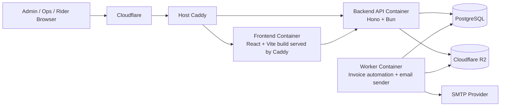
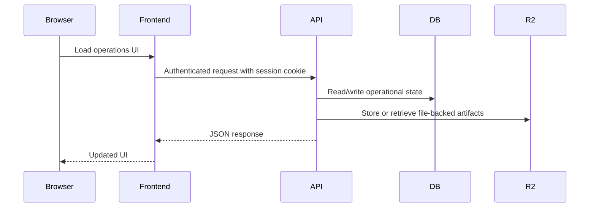
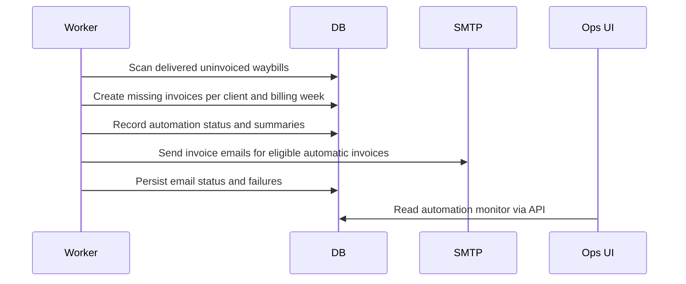

# Architecture Overview

This document gives a top-level view of the Waybill System so a new engineer can understand how the repo is organized, how requests flow, and how the major runtime pieces fit together.

## Purpose

The system digitizes a delivery operation that previously relied on manual paper waybills.

It covers:

- rider-created deliveries
- dispatch and return tracking
- recipient proof of delivery
- historical/manual delivery capture
- shift audit trail
- billing and invoicing
- scheduled invoice automation
- in-app operational notifications

## Runtime Architecture



## Main Runtime Responsibilities

### Frontend

The frontend is the operations workspace.

Responsibilities:

- login/session-based navigation
- admin, ops, and rider screens
- waybill creation and review
- shift dashboard and handover actions
- reporting and invoice review
- notification center

Primary code lives in:

- [apps/frontend/src/pages](/home/bernard/Work/way-bills/apps/frontend/src/pages)
- [apps/frontend/src/components](/home/bernard/Work/way-bills/apps/frontend/src/components)
- [apps/frontend/src/lib](/home/bernard/Work/way-bills/apps/frontend/src/lib)

### Backend API

The backend exposes authenticated business routes and owns system rules.

Responsibilities:

- auth and session cookies
- user, rider, and client management
- waybill lifecycle and locking rules
- shift and handover audit logic
- proof-of-delivery creation
- reporting and invoice APIs
- notifications
- PDF generation
- file uploads to R2

Primary code lives in:

- [apps/backend/src/routes](/home/bernard/Work/way-bills/apps/backend/src/routes)
- [apps/backend/src/lib](/home/bernard/Work/way-bills/apps/backend/src/lib)
- [apps/backend/src/db](/home/bernard/Work/way-bills/apps/backend/src/db)

### Worker

The worker is a separate long-running process from the API.

Responsibilities:

- scan completed billing windows
- generate missing weekly invoices
- send pending automatic invoice emails
- persist automation status for ops visibility

Worker entrypoints:

- [worker.ts](/home/bernard/Work/way-bills/apps/backend/src/worker.ts)
- [worker-health.ts](/home/bernard/Work/way-bills/apps/backend/src/worker-health.ts)

## Request Flow



## Invoice Automation Flow



## Data Model Overview

Core domain tables:

- `users`
- `clients`
- `waybills`
- `status_logs`
- `proof_of_deliveries`
- `waybill_handovers`
- `rider_shifts`
- `rider_shift_handovers`
- `invoices`
- `invoice_items`
- `notifications`
- `automation_job_statuses`
- `documents`

The schema lives in:

- [schema.ts](/home/bernard/Work/way-bills/apps/backend/src/db/schema.ts)

## Business Flows

### Live Delivery

1. Rider checks in to a shift.
2. Rider creates a waybill.
3. Waybill enters the queued/assigned workflow.
4. Rider dispatches one or more waybills.
5. Recipient signs on completion.
6. Waybill becomes billable and can later be invoiced.

### Historical Delivery Backfill

1. Rider or ops records a past manual delivery.
2. Receipt-photo evidence is attached instead of a recipient signature.
3. Record is clearly marked as historical/manual.
4. It still participates in billing and invoicing.

### Shift Handover

1. Outgoing rider initiates handover to the incoming rider.
2. Incoming rider accepts the handover.
3. Shift audit events are recorded with timestamps.
4. Notifications surface the pending handover.

### Invoice Automation

1. Worker scans delivered uninvoiced waybills.
2. It groups them by client and completed billing week.
3. It creates missing invoices idempotently.
4. It attempts email delivery for pending automatic invoices.
5. It writes status, summaries, and failure information for ops.

## Repo Layout

```text
way-bills/
  apps/
    backend/
      src/
        db/
        lib/
        routes/
      drizzle/
    frontend/
      src/
        components/
        pages/
        lib/
        auth/
        feedback/
        theme/
  deploy/
  docs/
```

## Deployment Shape

Production deploy is designed around:

- Docker Compose
- host-level Caddy
- PostgreSQL
- Cloudflare R2
- optional Cloudflare at the edge

Relevant docs:

- [deploy/README.md](/home/bernard/Work/way-bills/deploy/README.md)
- [docs/ops-runbook.md](/home/bernard/Work/way-bills/docs/ops-runbook.md)

## How To Read The Codebase

Suggested order for a new engineer:

1. Read [README.md](/home/bernard/Work/way-bills/README.md)
2. Read [architecture.md](/home/bernard/Work/way-bills/docs/architecture.md)
3. Read [schema.ts](/home/bernard/Work/way-bills/apps/backend/src/db/schema.ts)
4. Read [index.ts](/home/bernard/Work/way-bills/apps/backend/src/index.ts)
5. Read the main backend routes:
   - [waybills.ts](/home/bernard/Work/way-bills/apps/backend/src/routes/waybills.ts)
   - [shifts.ts](/home/bernard/Work/way-bills/apps/backend/src/routes/shifts.ts)
   - [invoices.ts](/home/bernard/Work/way-bills/apps/backend/src/routes/invoices.ts)
   - [reports.ts](/home/bernard/Work/way-bills/apps/backend/src/routes/reports.ts)
6. Read the shared frontend shell and main pages:
   - [AppLayout.tsx](/home/bernard/Work/way-bills/apps/frontend/src/components/AppLayout.tsx)
   - [WaybillPages.tsx](/home/bernard/Work/way-bills/apps/frontend/src/pages/WaybillPages.tsx)
   - [InvoicesPage.tsx](/home/bernard/Work/way-bills/apps/frontend/src/pages/InvoicesPage.tsx)
   - [ReportsPage.tsx](/home/bernard/Work/way-bills/apps/frontend/src/pages/ReportsPage.tsx)
